# Motivation/Seed

[TOC]

<details>
### Prologue: excerpt from Immanuel Erasmus' "Praise of Identity"  

Why did the Dinosaurs invent Christianity? I had a dream one night and at the end, was left with this question. At the start of the dream, a person with a staff was walking over a smooth mountain ridge. Then, there was a gathering of all dinosaurs, who knew they were going to be destroyed by this giant asteroid. What would you do - as a species, civilization or planet - if you knew you were all going to die \cite{nu het nog kan}? My dream told me, that they all gathered. And they drummed. And they directed all their energy on sending a message to the future. At the end, I saw a cross: $+$. That made me ask this question. However, it should be made very, very clear that the Dinosaurs probably did \textit{not} invent Christianity.
  Given this image, I once did a bedtime story about a world in which people were lighter than air, which meant that they would float away if they were not attached to the ground \cite{dat ene boek met die luchtschepen}. Therefore, they always stayed inside their houses, walking on what we would call our ceiling. Whenever they wanted to travel, they would crawl into a dodecahedral cage, attached to a train, so that they could be transported to their friends. Pip, the protagonist of this story heard the news of the asteroid and went to visit their good friend, Sky \cite{Wetiko legal principles}. Pip and Sky both concluded that the only option was for Pip to crawl into their cage and Sky would unlatch it.
  Pips cage flew up, up, up into the sky. Pip saw the world becoming smaller, and smaller, tinier and tinier, until the only thing they could see was only a pale blue dot. Then, there was only shadow. Only Darkness. Only dark grey shadows in the corners that were not lit by the glimmering stars. Pip closed their eyes because they were scared. 
  Startled, Pip opened their eyes, as a gentle tud brought their cage to a halt. A big constellation, made up out of many of these cages, surrounded Pips cage on all sides. After some searching, Pip found the middle. In the middle of this constellation, 119 other people had already gathered around the core of the meteorite \cite{to find: the paper that discovered the 120-cell}. They told Pip that they had gathered on this meteorite for centuries to find out what to do with the impeding transformations of our time. They were sending energy to a fire, which which was heating a rock, which was melting a block of ice. Pip started to blow air into the fire so that heats the rock and the ice melts and the river flows. Then, it split into a 3-dimensional set of axes. The octahedron is the image of the set of axes. When projected onto a 3-sphere and then onto a plane in the right way, an octahedron is $🜨$.
  Then, the problem that remained was, to land the 120-Cell of people in a safe way. From a multidimensional Laplace or Z perspective, that would mean integration. Complexly analyzed, it would be circling the residue of the poles, but then of course it would require a definition of what a pole would mean in this story. So I will leave the reader here with a question. Maybe [the proof is trivial](https://www.theproofistrivial.com/)?
  Ah yes, by the way when Max stared to infinity for too long in The Discovery of Heaven \cite{ontdekking vna de hemel}, a meteor fell on his head...

</details>
  
### Motivation/Seed

```
Comping to terms with Climate collapse
  |\-colonial roots, Indigenous solutions
  |\-Three stories of our time, where the story of The Great Turning is translated through the Union of the Condor and the Eagle through to Ragnarok and ultimately this thesis as a grain of sand on the way.
```

This is the story of Jaapie Goedhart, one of three alter-egos of mine. Jaapie has been a bit of an odd-one-out throughout his growing-up, always wondering more about the nature of existenc; the reason for Life than the people and world around. 

#### A needlessly mathematical conception of the pluriverse
  
Playful engagement with the Rust Ecosystem: To learn a skill, it always helps to have a goal, where pursuing this goal will give the skill as a side-effect. Well, I wanted to learn Rust, so I set out to do a little project. On [hi.gher.space](http://hi.gher.space) - a forum about higher dimensions -, mr_e_man was on about enumerating all possible configurations of solids around a point and there was some talk about writing a brute-force algorithm for finding Convex Regular Hydrated (faced) polytopes. This was also interesting, because I heard someone on a call say that "it is all coming together", where one reference also was to "sacred geometry" - I think referring to the platonic solids. In the following, I will take the icosahedron as an example:


  
**Fig. 1** perspective projection of the Icosahedron  

This shape is [famously constructed](https://youtu.be/VEJWE6cpqw0?t=426) from three golden rectangles, which is one of the reasons I like it and I think also the sacred geometry people like it:


**Fig. 2** The Icosahedron constructed as the convex hull of three golden rectangles

Now, let's use the Icosahedron to explain how the hi.gher.space people are able to type geometry. This is done using constructs called lace cities lace towers and lace unions that are arrangements of typeable ([ASCII](https://en.wikipedia.org/wiki/ASCII_art)fied) [coxeter-dynkin diagrams](https://bendwavy.org/klitzing/explain/dynkin.htm). Next, I will explain how lace cities and lace towers work, so that you will be able to understand typed geometry and maybe type up your own. The following is meant to be an intuitive explanation for someone not acquainted with mathematics. Therefore, it is not a proof. I will also  Coxeter-dynkin diagrams are rather abstract, but they provide a good handle to describe - symmetric - geometry on paper. Specifically - in the case of 3D -, a [Wythoff construction](https://en.wikipedia.org/wiki/Wythoff_construction). In typing, however, it is rather difficult to type a series of possibly connected, possibly circled dots: <media-tag src="https://cryptpad.disroot.org/blob/52/5230e8379d1108455bdf4bc6b85b79dcc548991ba88cfc8e" data-crypto-key="cryptpad:iMl/FCbWXx2biB7lD7pUBFp7nbpJN9/940JAlDF07Jg=">circled node</media-tag><media-tag src="https://cryptpad.disroot.org/blob/8b/8b3cb246fe8c727539679f06e2ea21ebdf1aed66d68af0a9" data-crypto-key="cryptpad:Z/XjPqnJgV20fWnbmKwP11gwGyZ30LAkhblfZ7gWvJg=">3-edge</media-tag><media-tag src="https://cryptpad.disroot.org/blob/59/593e085344bdf051d5e6df0f63d727accc54e739428cd913" data-crypto-key="cryptpad:Ku8Wj/S+ML43mXO/K+zB9mBZDSn+sfDjY9iWiWNIMsQ=">node</media-tag><media-tag src="https://cryptpad.disroot.org/blob/be/beb84afffc34e983a6506a1f10835cbd261f2d2a1a8301bd" data-crypto-key="cryptpad:4AZe6xzM6/A9IjO02yXCSsu1wjCMRzWX4CpMoFPiThs=">5-edge</media-tag><media-tag src="https://cryptpad.disroot.org/blob/59/593e085344bdf051d5e6df0f63d727accc54e739428cd913" data-crypto-key="cryptpad:Ku8Wj/S+ML43mXO/K+zB9mBZDSn+sfDjY9iWiWNIMsQ=">node</media-tag>. The equivalent - still meaning _icosahedron_ - is ASCIIfied `x3o5o`.

##### Balls and rods
  
To understand its meaning, let's break it down completely and then build from the respective "atomic" parts. Firstly, there are letters (`x` and `o`) that represent _nodes_ in the graph notation. Conceptually, these are mirrors with a specific orientation, together with a point at a particular distance away from that mirror. The letter (`x` or `o`) denotes the perpendicular distance to this mirror. `x`, Or <media-tag src="https://cryptpad.disroot.org/blob/52/5230e8379d1108455bdf4bc6b85b79dcc548991ba88cfc8e" data-crypto-key="cryptpad:iMl/FCbWXx2biB7lD7pUBFp7nbpJN9/940JAlDF07Jg=">circled node</media-tag>, denotes _"a unit edge"_ and `o` or <media-tag src="https://cryptpad.disroot.org/blob/59/593e085344bdf051d5e6df0f63d727accc54e739428cd913" data-crypto-key="cryptpad:Ku8Wj/S+ML43mXO/K+zB9mBZDSn+sfDjY9iWiWNIMsQ=">node</media-tag> denotes _"no edge"_. For a clear picture, imagine the screen to be a mirror, or the mirror to be aligned with the screen. For an `o` this is a dot exactly on the screen. When it gets reflected, it will stay in its place and thus give a single point. An `x` is a half-unit away from the screen. As it gets reflected, the reflection point is _exactly_ a unit-length apart. Therefore, it is a _lacing_ edge or, in physical words, a "rod", perpendicular to the screen.

Orientation, however, is context-dependent and initial orientation can be arbitrarily defined (including what a "unit" is). Thus, <!-- link to typography: https://tex.stackexchange.com/a/70462/241038 --> for easier typography, we could define the mirror to be horizontal and perpendicular to the screen:

```
-----
```

Then, `o` means a dot (`∙`) on the mirror: 

```
--∙--  a point on the mirror

--∙--  reflection does nothing

  ∙    and we are left with a point
```

and `x` a dot `∙` that gets reflected and laces to a vertical rod.
```
  ∙
----- A point above the mirror

  ∙
----- reflection adds a point below the mirror
  ∙

  ∙
  |   removing mirrors and lacing (connecting) unit edges gives a vertical rod
  ∙
```
Alternatively, we could say a point `.` reflects in the mirror `-` to give `÷`, which laces to `|`.
This allows me to type 1-D _lace towers_: a stack of dots and rods (1-D) that are spaced so far apart that they together form a polygon (2-D). stacking the vertical rod `x` on together with the central dot `o`, denotes as: `x || o` gives `| ∙`, spaced in such a way that it makes a unit triangle: `▷` and conversely `o || x` spaces `∙ |` to give the opposing unit triangle: `◁`. Similarly, two `x`s give a square: `x || x` spaces `| |` to give `□`.
  
Now, could we produce a rotated square `◇`, a pentagon `⭔` or hexagon (`⬡` or `⬣`)? Let's start with the square. From left-to-right, we start with a dot: `∙`, then we encounter the diagonal. Interestingly, the diagonal is not a line, but rather two vertices a diagonal length above each other. So, lets define `q` to be that length (√2): `：`. Thus, we arrive at `o || u || o` spacing `∙ ：∙`, to give `◇`. For the hexagon, we'll define `u := 2x` or double-length for `x || u || x` to give `⬡` and we'll define `h := √3`, so that `o || h || h || o` equals `⬣`. For the pentagon we define `f := φ := (1+√5)/2` to be its diagonal (which happens to be the golden ratio). Then, ⭔ gives `x || f || o`. At this point, pause and ponder for a moment, try to draw the shapes out on a piece of paper and "prove" to yourself that these constructions are valid. That is, please play with these tools, try to find other shapes and see if you can find any holes in the argumentation - to mathematicians, this is an enjoyable interaction -.

##### Lace cities
  
Next, for the pentagon and hexagon there is no character that spaces the vertices of the diagonal far enough (`f`) apart to be written in-line in unicode. Trying for the pentagon (`xfo`) gives: `| ：∙`, which doesn't look like a pentagon at all. A more accurate result can be obtained by manually spacing the points:
```
           pentagon                     hexagon
   o                            |                        o
o                        o      |  o o                o     o
     o  or, rotated:  o     o   | o   o or, rotated: 
o                               |  o o                o     o
   o                   o   o    |                        o
```
Which is the most basic form of a [_lace city_](https://bendwavy.org/klitzing/explain/dynkin.htm#segment): We have expanded the rods (1D) into individual vertices (0D).  
Now, how could we start to describe three-dimensional shapes using this system? Let's dive into the deep end and try to build a lace city for the icosahedron. Due to the extra dimension, we now have to use the direction perpendicular to the screen. That is: `x` sticks one-half towards you and one-half into the screen, which we'll define as the _z_-direction. So, let's take our icosahedron, and view it like this:  


**Fig. 3** edge-centered, orthographic and perspective projection of the Icosahedron
  
From the arrangement of golden rectangles shown earlier, we can see that the two (four) central vertices are a golden ratio apart _z_-wise (`f`) and the top- and bottom vertices a unit length (`x`). The four leftmost and rightmost points are on the screen. Again, pause and ponder, try to write out its lace city yourself, and - only - then, have a sneak peak at the solution below.
<details><summary>solution</summary>

```
    x             y
o       o         ^
  f   f    axes:  |
o       o         z--x
    x               z is out of the screen, towards you
    
 o   o
   f
x     x
   f
 o   o
```

</details>

##### Direct polygons
  
Having this description of the icosahedron is nice, but as mathematics - and especially geometry - tells us, there is much to be gained from applying different perspectives. We'll first construct polygons to construct the icosahedron as a lace tower, after which we'll build the icosahedron as a singular polyhedron. Firstly, lets see if we can condense the above lace city back into a lace tower. For that, we need to be able to directly construct polygons. This is the first time the edges come into play. In our icosahedral example, we had `2` `3` and `5` edges, corresponding to mirrors being at angles of 90°, 60° and 36°, or - in radians π/2, π/3 and π/5 respectively. Then, since mirrors are reflective, the mirrors themselves also get reflected, as in a kaleidoscope. As can be seen below, the total number of mirrors in a given symmetry is double the number.
  
```
    2            3           4          5 (couldn't draw)
    B               B           B
    |          \   /       \ | /     ..  / /
    |           \ /         \|/      .. //
----+----A   ----x----A  ----*----A  --- ---
    |           / \         /|\        //...
    |          /   \       / | \     / /..
```

<details><summary>Reflections of mirrors</summary>
  
```
Reflections of mirrors to obtain a kaleidoscope

  2-symmetry
  start     1 reflection  2 reflections
    B             B             B
    |             |             |
    |             |             |
    +----A  A'----+----A  A'----+----A
                                |
                                |
                                B'
  3-symmetry
       B     A'    B       A'    B       A'    B       A'    B
      /       \   /         \   /         \   /         \   /
     /         \ /           \ /           \ /           \ /
    x----A      x----A  B'----x----A  B'----x----A  B'----x----A
                                           /             / \
                                          /             /   \
                                         A''           A''   B''
  4-symmetry
       B        A' B     B' A' B        B' A' B        B' A' B        B' A' B        B' A' B
      /         | /       \ | /          \ | /          \ | /          \ | /          \ | /
     /          |/         \|/            \|/            \|/            \|/            \|/
    *----A      *----A      *----A  A''----*----A  A''----*----A  A''----*----A  A''----*----A
                                                         /              /|             /|\
                                                        /              / |            / | \
                                                       B''           B''A'''        B''A'''B'''
```
</details>
 
For simplicity, let's take the `2` symmetry to go further. As seen above, I've given the mirrors names "A" and "B". To relate those mirrors to, say `o2o`, we'll call the general case `a2b`, where a value (`o`, `x`, `q`, `u`, `f`) at `a` means moving (half) that distance away from mirror `A` and vice versa for `b`. So, `o2o` doesn't move the vertex `∙` away from any mirrors:
```
    B
    |
    |
----∙----A                  ∙      o2o
    |
    |
```
Now, `x2o` moves the point away from `A`, and not away from `B`:
```
    B           B
    |           |
    ∙           ∙           ∙
----+----A  ----+----A      |     x2o
    |           ∙           ∙
    |           |
```
`o2x` moves the point away from `B`, but not from `A`:
```
    B           B
    |           |
    |           |
----+∙---A  ---∙+∙---A     ∙-∙    o2x
    |           |
    |           |
```
and `x2x` moves the point away from both mirrors
```
    B           B
    |           |
    |∙         ∙|∙         ∙-∙
----+----A  ----+----A     | |    x2x
    |          ∙|∙         ∙-∙
    |           |
```
Please, try for yourself for the other symmetries, as well as for `x2f`.

<details><summary>`x2f`</summary>
    
```
    
    B           B
    |           |
    | ∙       ∙ | ∙        ∙---∙
----+----A  ----+----A     |   |    x2f
    |         ∙ | ∙        ∙---∙
    |           |
```    
</details>
  
<details><summary>3-symmetry</summary>
  
```
       B
  \   /
   \ /
----∙----A                  ∙       o3o
   / \
  /   \
   
       B
  \   /       \   /
   \ ∙         \ ∙           ∙
----x----A  --∙-x----A    ∙        x3o
   / \         / ∙           ∙
  /   \       /   \

       B
  \   /       \   /
   \ /         ∙ /         ∙
----x-∙--A  ----x-∙--A        ∙    o3x
   / \         ∙ \         ∙
  /   \       /   \
  
       B
  \   /       \ ∙ /         ∙
   \ / ∙     ∙ \ / ∙     ∙     ∙
----x----A  ----x----A             x3x
   / \       ∙ / \ ∙     ∙     ∙
  /   \       / ∙ \         ∙
```
  
</details>

##### Lace towers
  
Now we are able to type a polygon, lets see if we can condense the lace city from earlier, by going through it from top to bottom. We'll start with the lace city:

```
 o   o
   f
x     x
   f
 o   o
```
Now, we have to choose an orientation. In `a2b`, I'll define `a` to be sideways and `b` to be out of the screen. Thus, the mirror A is vertical, perpencdicular to the screen, and B is parallel to the screen:

```
   A
 o | o   BBBBB 
   f     BBBBB
x  |  x  BBBBB
   f     BBBBB
 o | o   BBBBB
```
At the top, we have two `o`s on the same line, that are `x` apart, which gives an `x2o`
```
   A
 o---o   --- x2o
   f
x  |  x
   f
 o | o
```
Next, we have a single `f`, so that gives an `o2f`:
```
   A
 o | o   --- x2o 
   f     --- o2f
x  |  x
   f
 o | o
```
two `x`'s that are `f` apart, giving `f2x`:
```
   A
 o | o   --- x2o 
   f     --- o2f
x - - x  --- f2x
   f
 o | o
```
and the same, in reverse for the bottom.
```
   A
 o | o   --- x2o 
   f     --- o2f
x  |  x  --- f2x
   f     --- o2f
 o | o   --- x2o
```
If we remove the lace city, we are left with a lace tower:
```
x2o
o2f
f2x
o2f
x2o
```
Beautiful!
  
Now, the `2`-symmetry is not the only 2D (sub)symmetry of the Icosahedron. There are also the `3` and `5` symmetries. To find the `5` lace tower, which is slightly easier, lets look at the icosahedron in the most pentagonal way possible. 


**Fig. 4** vertex-centered, orthographic and perspective projection of the Icosahedron.

From this, we can build a lace tower, by going through the shape front-to-back and seeing what we encounter on the plane parallel to the screen. First, there is a point (`o5o`), then a pentagon facing one way (`x5o`), followed by a pentagon facing the other way (`o5x`) and, finally, a point (`o5o`). Fully typed out:

```

o5o   point
x5o   pentagon
o5x   opposite pentagon
o5o   point (far side)
```

Let's take a look at the most trigonal way possible:


**Fig. 5** face-centered, orthographic and perspective projection of the Icosahedron

As before, going from front to back, we first encounter a normal triangle, `x3o`. Then, there are two triangles that form the projection envelope. To find its length, note that it is the diagonal of a pentagon, so `f`. The `f` triangle with the flipped orientation `o3f` is slightly closer to us, which gives the lace tower:
```
x3o
o3f
f3o
o3x
```
<details>
##### observations
  
An additional meta-perspective we can take now, is to vertically look at one side of these towers. So lets take the pentagonal tower, which is the simplest:

```
o5o
x5o
o5x
o5o
|  \-ooxo
oxoo
```

Let's follow `oxoo`, and look at fig. 4. First, there is an `ox`, so a `◁` triangle, followed by an `xo` or `▹` triangle, topped of by `oo` or `-`-edge. Conversely, there is a `-◁▹` structure on the right. Please verify that these structures are indeed on the icosahedron in fig. 4. 

```
x3o
o3f
f3o
o3x
| \-ofox
xofo
```
In the left of trigonal symmetry (fig. 5), we start with `xo` or `▹`. The next pair, `of` doesn't create a triangle, but a `<` shape still fits, followed by `fo`, or a `>` shape. Interestingly, if we skip the `f`, there is also an `oo` edge. Thus, in this case, `xofo` makes a:
```
     ∙  --\
∙   / \    \
| >∙---∙    > these two vertices are not on the same plane as the rest
∙   \ /    /
     ∙  --/
```
structure. However, when flat this would be `xoho`, where `h=√3≈1.732`>`f=φ≈1.618`. Thus, for this structure to work, the two vertices formed by `f` have to be some distance offset from the plane that is the screen to be able to form triangles. Since we'll be discussing 4D geometry in a bit, please take some time to emphatize with a 2D being, also known as a flatlander. This being, that lives entirely in the screen has a really hard time to understand that these points are pushed into another dimension to make the triangle edges unit lenght. For a thorough explanation of 4D visualization, the reader is referred to [Quickfur's website](https://www.qfbox.info/4d/vis/vis). Anyways, the right side, `ofox` gives:

```
  ∙      --\
 / \   ∙    \
∙---∙< |     > these two vertices are not on the same plane as the rest
 \ /   ∙    /
  ∙      --/
```
</details>

Finally, from the trigonal and pentagonal lace tower, we can also build lace cities:

```
x3o  ---    x  o
o3f  ---  o    f
f3o  ---    f    o
o3x  ---    o  x
```
and
```
o5o  ---     o
x5o  ---  x   f  o
o5x  ---  o  f   x
o5o  ---     o
```
Please verify that these are just rotated versions of the 2-symmetrical lace city:
```
 o   o
   f
x     x
   f
 o   o
```
<!-- further: It has on one side an `x3o` (<media-tag src="https://cryptpad.disroot.org/blob/52/5230e8379d1108455bdf4bc6b85b79dcc548991ba88cfc8e" data-crypto-key="cryptpad:iMl/FCbWXx2biB7lD7pUBFp7nbpJN9/940JAlDF07Jg=">circled node</media-tag><media-tag src="https://cryptpad.disroot.org/blob/8b/8b3cb246fe8c727539679f06e2ea21ebdf1aed66d68af0a9" data-crypto-key="cryptpad:Z/XjPqnJgV20fWnbmKwP11gwGyZ30LAkhblfZ7gWvJg=">3-edge</media-tag><media-tag src="https://cryptpad.disroot.org/blob/59/593e085344bdf051d5e6df0f63d727accc54e739428cd913" data-crypto-key="cryptpad:Ku8Wj/S+ML43mXO/K+zB9mBZDSn+sfDjY9iWiWNIMsQ=">node</media-tag>) and on the other `o5o` (<media-tag src="https://cryptpad.disroot.org/blob/59/593e085344bdf051d5e6df0f63d727accc54e739428cd913" data-crypto-key="cryptpad:Ku8Wj/S+ML43mXO/K+zB9mBZDSn+sfDjY9iWiWNIMsQ=">node</media-tag><media-tag src="https://cryptpad.disroot.org/blob/be/beb84afffc34e983a6506a1f10835cbd261f2d2a1a8301bd" data-crypto-key="cryptpad:4AZe6xzM6/A9IjO02yXCSsu1wjCMRzWX4CpMoFPiThs=">5-edge</media-tag><media-tag src="https://cryptpad.disroot.org/blob/59/593e085344bdf051d5e6df0f63d727accc54e739428cd913" data-crypto-key="cryptpad:Ku8Wj/S+ML43mXO/K+zB9mBZDSn+sfDjY9iWiWNIMsQ=">node</media-tag>). (There is also a hidden 2-edge `x2o`, connecting the ends, thus it a triangle, but that won't become relevant in our analysis.) What is defining the symmetry here, are the numbers `3` and `5` (and `2`). Surrounding those are  Thus, `x3o` denotes a triangle, say △, and `o3x` denotes the opposite triangle, say ▽. `o3o` and `o5o` have no edges around a point, so will not create any polygon of their own. When used in conjunction, however, it will rotate the entire structure `3` respectively `5` times around that point. Putting it all together, we can see that `x3o5o` has one triangle (`x3o`), which is rotated 5 times around each point (`o5o`). Please inspect the icosahedron to verify that this is indeed the case for all vertices. Now, that's nice: `x3o5o` by itself reveals that we have a polyhedron constructed of triangles (`x3o`), where there are five around a point (`o5o`). For the rest, however, it doesn't explain very much. Especially: How can we easily find the golden rectangles within this shape?  

or, as a one-liner, described in Klitzing (2000): `o5o || x5o || o5x || o5o`. Note that the edges connecting layers are implied: the height of `o5o || x5o` - into the third dimension - is implied from their respective radii (Klitzing, 2000). A beautiful side-effect of this notation is that we can analyze it vertically as well: On the left we have `o x o o` and on the right there is `o o x o` If `x` represents _a unit edge_, and `o` _no edge_ i.e. a point on 
  
  -->
##### Direct polyhedra

Another question that arises is whether we can also condense lace towers into something. We've seen it for polygons, where `xfo` is `x5o` and `ofx` is `o5x`. Now, `x5o` means that there are 5 rods around a point. One dimension up, say `x3o5o`, that would mean 5 `x3o`'s (triangles) around a vertex. This gives an icosahedron.  Conversely,an `o3o5x` reflects 3 pentagons around each vertex.
  
In terms of mirrors, we'll loosely follow [Kliting's explanation](https://bendwavy.org/klitzing/explain/dynkin.htm). In the abstract perspective of dynkin diagrams: If we add another node (`o`) to the graph, `x3o`, we'll need to define two additional edges.

```
    o      -- we add this node
  
  

x---3---o
  
    o
   / \
  ?   ?    -- which numbers fit here?
 /     \
x---3---o
```

This structure is known as a [schwarz triangle](https://bendwavy.org/klitzing/explain/schwarz.htm). There are only that many numbers that fit in the `?` places, and for our interest: the icosahedron, these are `2` and `5`

```
    o
   / \
  2   5
 /     \
x---3---o
```
Now, if we say that `2`-edges are always implied when the edge is not mentioned, this can be written linearly as `x3o5o`. What does this mean for the placement of mirrors? Let's start with the `x3o`, where we placed mirrors `A` and `B` with an angle of π/3 or 60°:

```
   A
  /
 /
x----B
```

Now, we need to add another mirror that has angles π/5 and π/2 or 36° and 90°. If you've studied geometry, you'll notice that these do not add up to 180°. That is because we are in _spherical geometry_. I find calculation in spherical geometry rather difficult, and - for my implementation - implemented Messer (2002). For the simplest case, `a2b2c`, imaegine you are walking or flying over the earth, starting at the north pole. Fly South, down to the equator, then make a 90° left turn, towards the East. Fly 90°, or approximately 12000 km, and take another 90° left turn towards the North. Once you reach the North pole, you will arrive at an angle of 90° from where you started.

```
       *    α=π/3
      /|    β=π/5
     /-|    γ=π/2
    / β|
   /   |
  /    |
 /\α γ/|
x------+
```

##### Diminishings

Now, in 3D there are many more possible shapes, starting with [platonic](https://www.qfbox.info/4d/platonic) [solids](https://en.wikipedia.org/wiki/Platonic_solid) (regular polyhedra), [archimedean](https://www.qfbox.info/4d/uniform3d) [solids](https://en.wikipedia.org/wiki/Archimedean_solid) , that together with prisms and antiprisms form [uniform polyhedra](https://en.wikipedia.org/wiki/Uniform_polyhedron#Convex_forms_by_Wythoff_construction) and then [Johnson](https://bendwavy.org/klitzing/explain/johnson.htm#crf.htm) [Solids](https://www.qfbox.info/4d/johnson).
  
Using notation we just learned, we can also type out all johnson solids. Let's start with diminishings of the icosahedron, of which there are four. A diminishing of a polyhedron is when part of the polyhedron is removed, in such a way that the created hole can be filled with a polygon. This is best explained by fig. 6, which depicts the para- (opposite sides) -bi- (double) diminishing of the icosahedron.
  
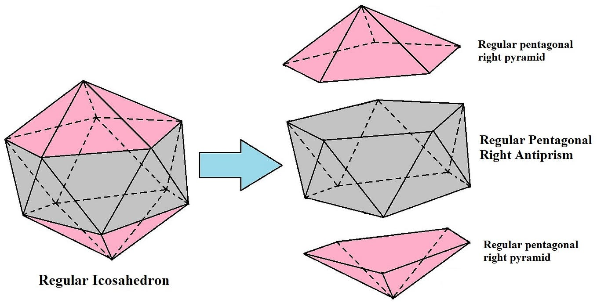

**Fig. 6** Pentagonal antiprism as parabidiminished icosahedron (Rajpoot 2023).

The other diminishings are shown in fig. 7.
  
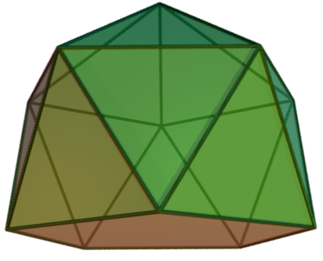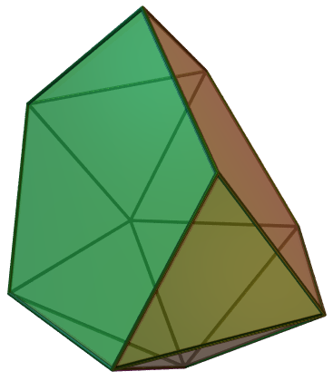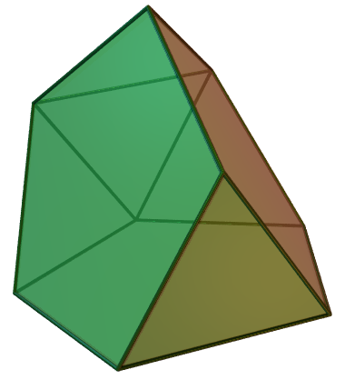

**Fig. 7** (mono)diminished, metabidiminished and tridiminished icosahedron

Now, let's construct the diminished icosahedron by removing a vertex. The remaining shape still has 5-symmetry, so we'll use that lace city:
```
Icosahedron
o5o  ---     o
x5o  ---  x   f  o
o5x  ---  o  f   x
o5o  ---     o      -- remove this vertex

diminished icosahedron
o5o  ---     o      -- remove this vertex
x5o  ---  x   f  o
o5x  ---  o  f   x
  
parabidiminished icosahedron
x5o  ---  x   f  o
o5x  ---  o  f   x
```
Great! Now, from these lace towers and cities, we can see that a pentagonal face (`x5o` or `x   f  o`) is created. Then, constructing the metabidiminished is best viewed in 2-symmetry:
```
Icosahedron
x2o  ---     x      |  o   o
o2f  --- o       o  |    f     -- remove these vertices
f2x  ---   f   f    | x     x
o2f  --- o       o  |    f
x2o  ---     x      |  o   o

metabidiminished icosahedron
x2o  ---     x      |  o   o
                    |
f2x  ---   f   f    | x     x
o2f  --- o       o  |    f
x2o  ---     x      |  o   o
```
Here, we can try to identify the two pentagons (`xfo`). In the lace city, they form the hat. In the lace tower, there is `xfo` twice: Once on the top-left, and once on the bottom right. Which ones form pentagons is best concluded from the lace cities.

<details><summary>pentagons</summary>

```
top pentagons
 o   o
  
x     x
   f

bottom pentagons (intersecting and not a face)
  f   f
o       o
    x
```
</details>

The tridiminished icosahedron is best viewed in 3-symmetry:
```
Icosahedron
x3o  ---    x  o
o3f  ---  o    f   -- remove these vertices
f3o  ---    f    o
o3x  ---    o  x
  
x3o  ---    x  o

f3o  ---    f    o
o3x  ---    o  x
```
  
<details><summary>pentagons</summary>

```
left pentagon
x
  
f
o

right pentagons
x  o

f    o
   x
```
</details>

[<media-tag src="https://cryptpad.disroot.org/blob/86/865d4dc0c5f4e3863f089ab3b0ffbc56d28eaf5e22b66a60" data-crypto-key="cryptpad:freVOIuyd0w+TxNZ2mM9+E5xgHvUqCpYBGTQkLLm6+Y="></media-tag>](https://xkcd.com/356/)

**Fig. 8** Image trying to convince the reader to get interested and collaborate.

##### Expanded kaleido-facetings

[Of particular interest within the Johnson solids are 8 johnson solids that constitute the so-called "Crown Jewels" of the set, since they cannot be constructed by simple "lego-ing" of smaller parts.](https://www.qfbox.info/4d/johnson) It was discovered in 2014 that three of these crown jewels, the bilunabirotunda, triangular hebesphenorotuna and orthocupolarotunda can be derived from the icosahedron in a special way. We'll start with the bilunabirotunda, following [Quickfur's explanation](https://www.qfbox.info/4d/J91).

<media-tag src="https://cryptpad.disroot.org/blob/93/93368513feab97de24c63b6473485503bc2caa240fdeb863" data-crypto-key="cryptpad:qW+GmoAV7up0UfkFFTEk5fKAZErw70hNCK1Pvr7VOZE="></media-tag>

**Fig. 9** The Bilunabirotunda

The most apparent symmetry is a `2`-symmetry, so we'll look at that lace tower of the icosahedron.

```
Icosahedron
x2o  ---     x      |  o   o
o2f  --- o       o  |    f
f2x  ---   f   f    | x     x
o2f  --- o       o  |    f
x2o  ---     x      |  o   o
```
In the lace city, we can recognize two pentagons at the top:
```
                      \     /
             x      |  o   o
         o       o  |    f
           f   f    | x     x
                     /       \
                   intersecting pentagons
```
and two at the bottom:
```
                     \       /
           f   f    | x     x
         o       o  |    f
             x      |  o   o
                      /     \
                   intersecting pentagons
```
They are also apparent in the right side of the lace tower, which reads `ofxfo`. Now, we can apply the operation shown in fig. 10.
  
<media-tag src="https://cryptpad.disroot.org/blob/43/43c61c9b0e35e192af1e17f7befd6240124065ee0442f648" data-crypto-key="cryptpad:3Ms5PbCNEAC18LSuXnfm/nEBcEWFtu9bvoCavqDyKsQ="></media-tag><media-tag src="https://cryptpad.disroot.org/blob/ab/abb11cc4c3decfd7746ddc122e633a9223410914ed617292" data-crypto-key="cryptpad:jrIQ+KFAjydSrMPgBEsJCoztpb2GzQAcnHmNi10gNNE="></media-tag>

**Fig. 10** Icosahedron becoming bilunabirotunda by partial stott expansion.
  
In the lace city, this can be done as follows:
```
                   :  o   o
                   :    f
                   : x     x
                   :    f
                   :  o   o
                   : <-----> pull apart
                   :      o
                   :    f   f
                   : x         x
                   :    f   f
                   :      o
```
And we get the right side view of the bilunabirotunda in fig. 11:

<media-tag src="https://cryptpad.disroot.org/blob/68/68028864396c62e44dc666c7ae2147a6ab1ea2d473879943" data-crypto-key="cryptpad:SWdeo/akJfFL8TXldwETdZFByYZImN9EZXE30uit9q8="></media-tag><media-tag src="https://cryptpad.disroot.org/blob/06/0630d4229800ca4a0efa2b604f1b8bf6f555293ed6a0b199" data-crypto-key="cryptpad:Lqg1e/WkeMGE4kMToVdj5fhmej/317Al5lv8cZvcrPo="></media-tag>

**Fig. 11** edge-first and square-first projections of bilunabirotunda
  
Now, what happened?
1. The two `o`s that were `x` apart merged into a single `o`
2. The `f`'s in the middle were split into four `f`'s, forming a unit square
3. The outer `x`'s just moved outwards

If we look at what this would look like on the left lace city that'd be:
```
           x      :
       o       o  :
         f   f    :
       o       o  :
           x      :
       pull apart perpendicular to the screen
           o      :      o
       x       x  :    f   f
         F   F    : x         x
       x       x  :    f   f
           o      :      o
```
which gives the left side view of fig. 11. Let's take a closer look at all polygons. 
<details><summary>polygons in lace cities</summary>

```
luna triangles
       x       x  :    f   f
       |>F   F<|  : x< |   | >x
       x       x  :    f   f
luna squares
       x       x  :    f---f
       |       |  :    |   |
       x       x  :    f---f
top rotunda triangles
           o      :      o
       x       x  :    f   f
bottom rotunda triangles
       x       x  :    f   f
           o      :      o
top rotunda pentagons
           o      :      o
       x       x  :    f   f
         F   F    : x         x
bottom rotunda pentagons
         F   F    : x         x
       x       x  :    f   f
           o      :      o
```

</details>

<media-tag src="https://cryptpad.disroot.org/blob/2e/2e91b516583cfa87c2b59ac0af044fdfa35530446acf721b" data-crypto-key="cryptpad:W2k5alV3h3Fd+sm901jM8cLGaFd2jPRmxyny+dRrFtk="></media-tag><media-tag src="https://cryptpad.disroot.org/blob/49/494db24c4c4a71676a463bd2cb14e62ccb413245c4b1d3e3" data-crypto-key="cryptpad:OnADuxU9t1d8U6b2UnhIzvlD+FVa3tT119MNOUO9qws="></media-tag>
  
<!-- > -->
Now, the most interesting thing that happened, is that we did not move all points away from each other. Indeed, the `x` was squished into an `o`. What we actually do, is invert the x, so the two crossing pentagons:
```
faceted Icosahedron        these have swapped places
                           / \
(-x)2o  ---    -x      |  o   o
   o2f  --- o       o  |    f
   f2x  ---   f   f    | x     x
   o2f  --- o       o  |    f
(-x)2o  ---    -x      |  o   o
                           \  /
                           these have swapped places
```
In a `2`-symmetry, nothing happens if we invert an edge. However, in - say - a `3`- or `5`-symmetry, extra care is needed to make sure that the vertices stay at the same location.
```
x3o Remember, x moves 1 away from A and is on B
       B           B
  \   /       \   /        \   /
   \ ∙|1       \ ∙          \ ∙
----x----A  --∙-x-----A  --∙-x----B
   / \         / \          / ∙
  /   \       /   \        /   \
  
(-x)3o       x moves 1 away from A in the opposite direction and is on B
       B
  \   /       \   /       \   /
   \ /         \ /         ∙ /
----x----A  ----x-∙--A  ----x-∙--A
 1|∙ \         ∙ \         ∙ \
  /   \       /   \       /   \
(-x3x)   In order to get the same shape, we have to make sure the point lies on B'
       B           B           B
  \   /       \   /       \   /
   \ /         \ ∙         \ ∙
----x----A  ----x----A  --∙-x----A
   / ∙|1       / ∙         / ∙
  /   \       /   \       /   \  
       B'          B'          B'
This gives the following triangle (which is hard to draw in ascii)
             Β
           /
         ∙
       /β|
     /   a
\  /\⟂   |⟂
 x---\---|----Α
/  \α b  a
     \ \α| -- this is α, because both right-angled triangles share β
       \\|
         ∙

b=d(-x,B)=2a cos(α)  (a=1)
         = 0  (α=π/2)
         = 1  (α=π/3)
         = √2 (α=π/4)
         = φ  (α=π/5)
```
using this faceting scheme, 

<!-- <media-tag src="https://cryptpad.disroot.org/blob/1d/1d267a6c7bd063d2e5da998f04f61bb60d9f63aaabd0da37" data-crypto-key="cryptpad:5vXJaeIMSHkO/XxeE7E4Qb01GXDWM9gbezVt0wDaw5A="></media-tag>
<media-tag src="https://cryptpad.disroot.org/blob/4c/4ceb7c7a6dac9dfd4b1360cbb09e4209c44cc80c1ad987c1" data-crypto-key="cryptpad:bSIaLuYws2/SLyr7St/XgV80qV7/aHqY5psJNg7h0bM="></media-tag>
<media-tag src="https://cryptpad.disroot.org/blob/09/099da66baa21242c5f6721d721cade732ec59e4846397f69" data-crypto-key="cryptpad:igMDZZl/SPFAAwmzvGXkJzYlvEyjUUe7qDju4xSMa9U="></media-tag> -->

**Fig. 12** `2`, `3` and `5` Expanded kaleido-facetings of icosahedron

In terms of lace towers:
 
```
original
     faceted
           expanded
bilunabirotunda
x2o (-x)2o  o2o
o2f    o2f  x2f
f2x    f2x  F2x
o2f    o2f  x2f
x2o (-x)2o  o2o

triangular hebesphenorotunda
x3o (-x)3x  o3x
o3f    o3f  x3f
f3o    f3o  F3o
o3x    o3x  x3x

pentagonal orthocupolarotunda
o5o    o5o  x5o
x5o (-x)5f  o5f
o5x    o5x  x5x
o5o    o5o  x5o
```

##### Adding the 4th dimension

Adding a fourth dimension to our geometry brings an immediate problem: I cannot see or feel in 4D, since the visible physical world is 3D. Therefore, I have not developed the necessary intuition to be able to see 4D. One may argue that it is not needed to have visual 4D intuition, since mathematical analysis is enough to draw conclusions.

However, mathematical analysis also builds on - learned - intuition. For me it even goes as far as that I find intuition in normal social situations difficut if I have not built a fitting mathematical framework for that situation.

Following [Quickfur's explanation](https://www.qfbox.info/4d/vis/05-proj-1), which you should absolutely read righ now, we'll shortly discuss how to visualize a 4-dimensional object. For that, we'll start out with the simplest shapes: geometric ones. That all edges are the same length means that all distortions are because of rotations relative to the viewpoint. If that's difficult to understand, picture a square:

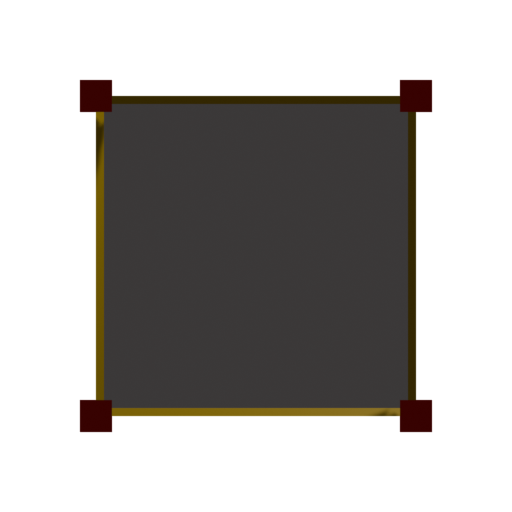

We and a 2D being will agree that it is possible to rotate the square by 45 degrees:

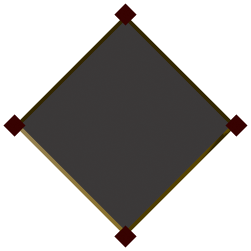

As 3D beings, however, we'll tell the 2D being that there's another 2 axes of rotation. For example, we'll say it is possible to rotate the square by 45° along its right edge:

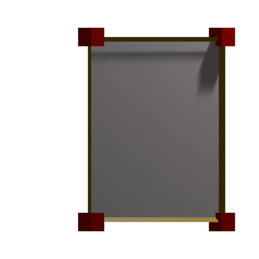

As we can see, it appears as if the left edge has only moved towards the right. We'd tell the flatlander that the edge has moved and that the square is now sticking out of the screen. Especially in the case of a 90° rotation, where the square would only appear as a single edge:

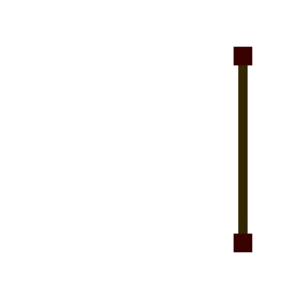

And when rotating:

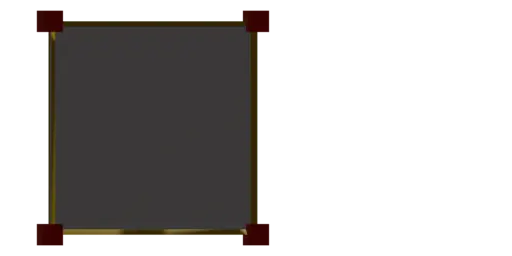

The same happens one dimension up - by dimensional analogy: In an orthographic projection, a rotation in a direction that goes "one dimension up" can be seen as "squishing" the object in the other direction:

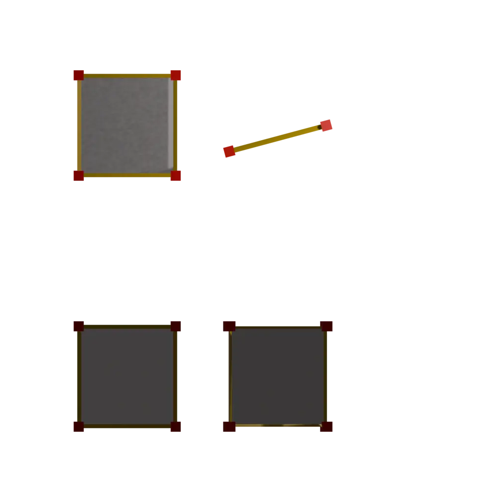
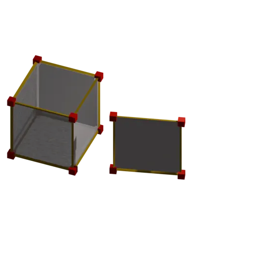

Now we have a bit of a grasp of what rotation does, lets take a look at a 4D object: the icosahedral pyramid, which can be constructed by adding a vertex above an icosahedron, in the same way that a pentagonal pyramid can be constructed by adding a vertex on top of a pentagon: 

[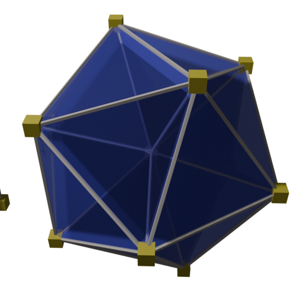](./img/ikepy.png)[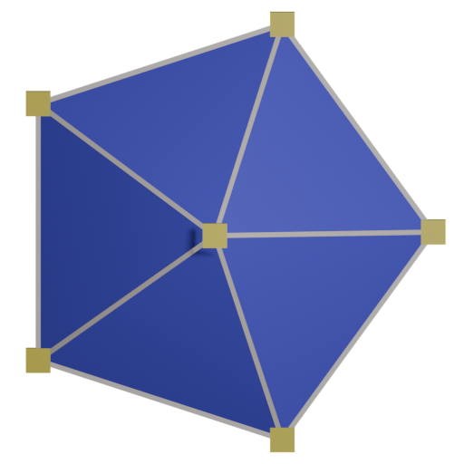](./img/peppy.png)

The above is where we view the pyramid from the top, centering the top vertex. Alternatively, one could look from either the side or bottom, showing its triangular face:

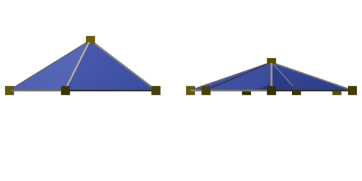
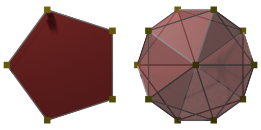

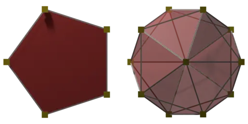
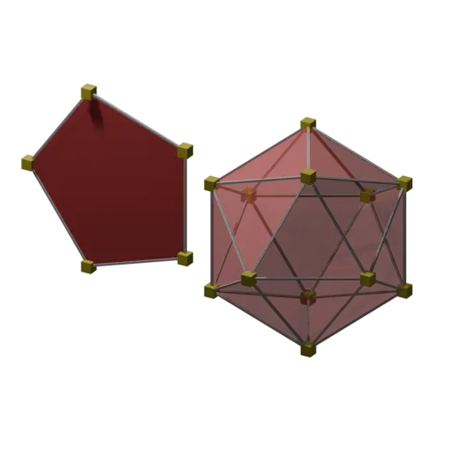

When the base of the pyramid, coloured in red, is visible, it actually obscures the view of the triangles/tetrahedra that connect it with the point, coloured in blue. Since I built the icosahedral pyramid in 3D software, we cannot properly shade it: Shadows and light reflection that allow us to intuitively infer the 3-dimensionality from the pentagonal pyramid on the left simply does not work for the icosahedral pyramid, since it is a 4D object and the software is 3D, so I had to manually construct a 3D projection of the icosphere including its rotation.

In lace towers, the two would look like the following:

```
pentagonal pyramid | icosahedral pyramid
o5o                | o3o5o
x5o                | x3o5o
```

The one on the left, we can easily understand, and we can understand the layers of the one on the right, but it becomes more difficult to grasp when those layers are stacked on top of each other. Additionally, one may wonder if the icosahedral pyramid is part of a lerger shape, in the same way that a pentagonal pyramid is part of an icosahedron. Indeed, this is the case: it [forms the top of a 600-cell](https://www.qfbox.info/4d/600-cell)


Now, there are more possible shapes than only the icosahedral pyramid. Klitzing, in (2000) has shown that all platonic solids separately can form 4D shapes that all have unit edge length; the segmentochora. In 2014, 

##### Towards the pluriverse


Notably, [cube atop icosahedron](https://www.qfbox.info/4d/K4-21) is a shape that combines two polyhedra from different symmetry groups. Please follow the link to learn about its structure. Below is an image of its rotating wireframe. Please take the time to squint your eyes and see it as an actually rotating object, around a vertical axis to the viewpoint.

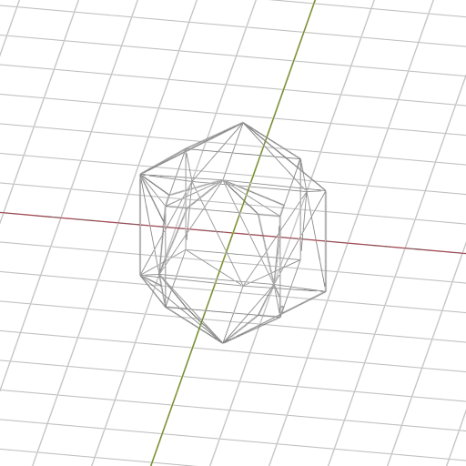

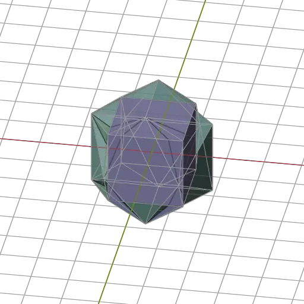

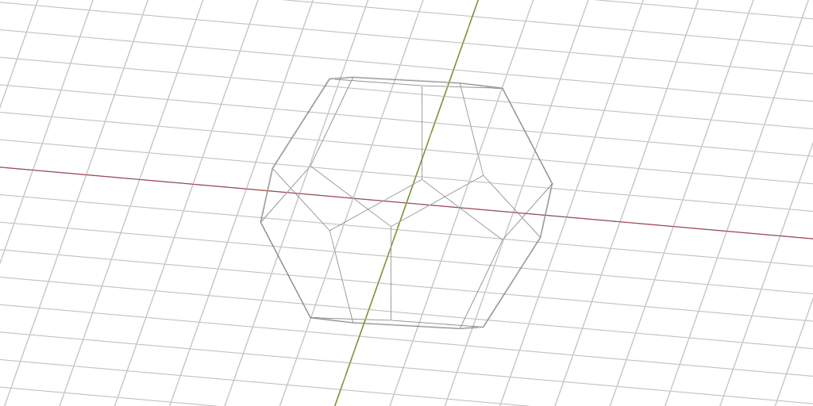

I personally especially like the following stack:

```
x3o3o
x3o4o
o3o4x
x3o5o
o3o5x
```
  
This is a stack of all platonic sol

```
o3o3o5x <- 120-cell
```

Rather, they rely on "partial stott expansion"/[Expanded Kaleido-faceting](https://bendwavy.org/klitzing/explain/ekf.htm) ([J91](https://qfbox.info/4d/, J92), "snubbing" (J84, J85), cut-open-and-modify (J86, J88, J89). It has been proven (Johnson, 1966) that these are the only 3-dimensional convex polyhedra with regular faces. The interesting question thereafter is: [How many of those exist in 4D](http://hi.gher.space/wiki/CRF_polychora_discovery_project)? We know that the number is finite, but very large. The 600-cell alone has over a billion separate diminishings. Therefore, the search is mostly centered on "interesting" or crown-jewel-like polychora. Especially the question of the existence of non-prismatic polychora that have cut-open-and-modify or snub Johnson Solids remains open as a smaller sub-question. Now, that would require a brute-force search algorithm on 4-dimensional geometry, which I set out to lay the groundwork for.
  
My main interest in 4D geometry, however, is an artistic one, and one of the most beautiful things of 4D are Dr. Richard Klitzing's Lace Cities. Below, I have used the []"pentagonal lace city" of the 600-cell](https://bendwavy.org/klitzing/incmats/ex.htm) to describe electrostatic potential. (the polychoron is cut in half and the "halves" are put on each other)
```
            o5f                     o5f              
     x5o                                   x5o       
                                                     
                 f5o           f5o                   
      - - - - - - - - - o5f - - - - - - - - -        
     o5o-- -- -- -- -- ----- -- -- -- -- --o5o       
            o5x--- --- ----- --- ---o5x              
             -------------------------                 
              ----------x5o----------                
                 o5o_____|_____o5o                   
                         |  
                         ⚡
                _________|________  
                 o5o+++++|+++++o5o                   
                 +++++++o5x+++++++                   
              +++++++++++++++++++++++                
            x5o+++++++++++++++++++++x5o              
     o5o+++++ +++ +++ ++++++ +++ +++ ++++++o5o       
      ++ ++ ++ ++ ++ ++f5o++ ++ ++ ++ ++ ++ ++     
                 o5f           o5f                   
                                                     
     o5x                                   o5x       
            f5o                     f5o              
                                                     
o5o                     x5x                     o5o  
```
Additionally, Quickfur [on his website](https://www.qfbox.info/) has beautiful visualizations of 4D geometry, which I cannot make. Now, to get to visualizing them in a rather convoluted way, the computer should be able 
  
one should be able to create coordinates and connections from a lace city, after which they can be rendered as a projection into 3D space. These lace cities quite accurately describe a polytope, so it would be possible to get coordinates and thus build a 3D mesh from such a lace city. That was a very interesting project to help me get to know Rust.
  
So, for getting to polytopes from lace cities, the Coxeter-Dynkin notation used on hi.gher.space needed to be taught to the computer, so that we could do `x5o->[coordinates]` or `x3o5o->[coordinates]`. The first step wat to find the corresponding mirrors based on a symmetry e.g. `.3.5.->[reflection matrices]`, which I conveniently found in (Messer, 2002). Then, however, reflecting a point -and the corresponding matrices- n times for an n-gon quickly ramped up the floating-point error in the calculations. So, I set out to teach the computer how exact arithmetic works. A month of programming later, I had come up with [exxact](https://crates.io/crate/exxact).
  
While developing, two distinct things happened:
1. By working with fractions a lot, the fact that I was programming in an English-based programming language, including its libraries became confusing. In Dutch, a Fraction has a _teller_ (numerator) and _noemer_ (denominator). Since I learned arithmetic on fractions in Dutch, I internally think about them in Dutch, which leads to a confusing translation step when programming in English.
2. I had re-invented the wheel, with slightly different focal points. Specifically, e-graphs good was an existing equality library, on which the symbolic mathematics of Julia is based.

